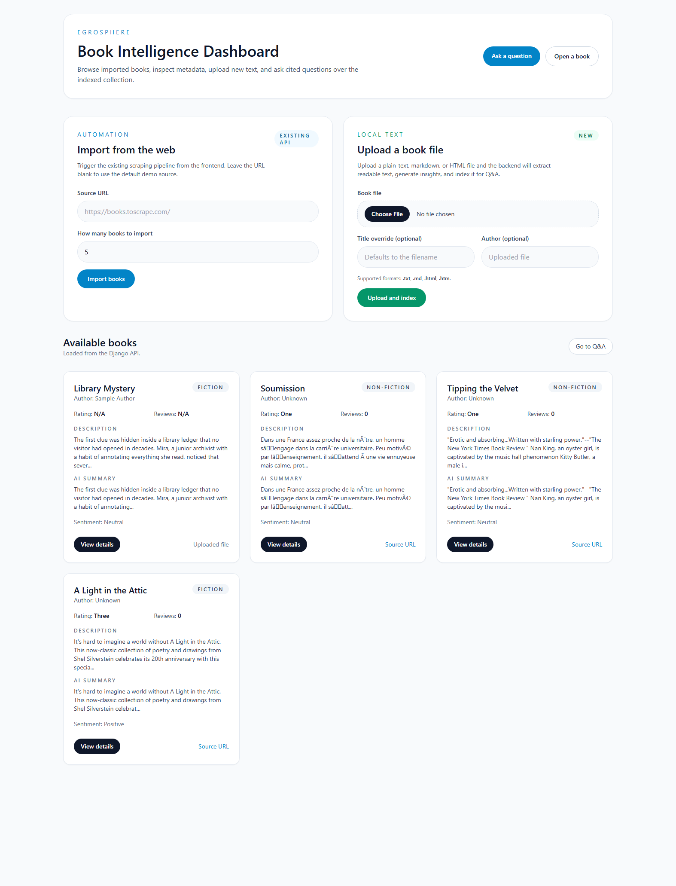
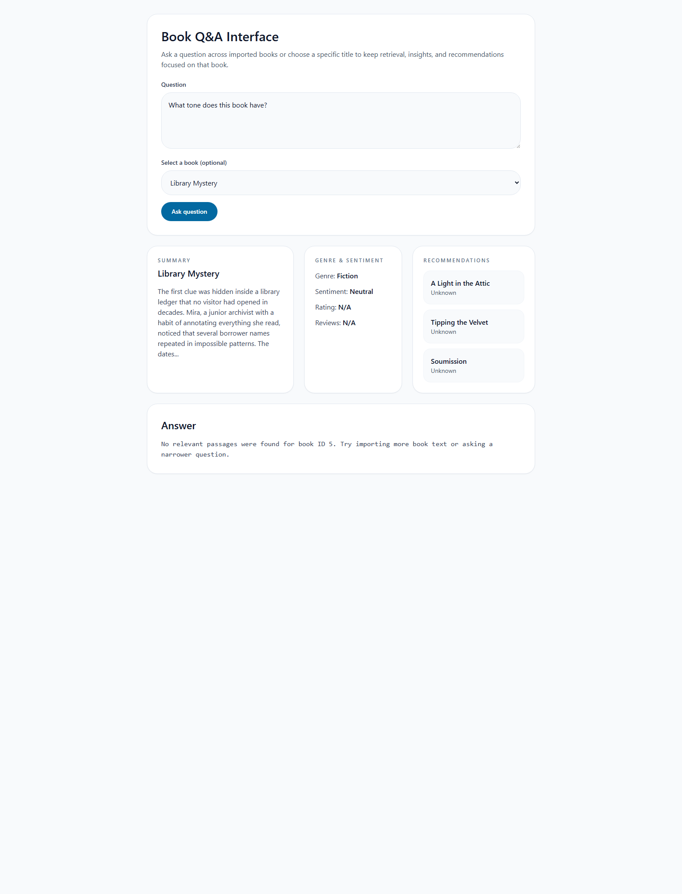
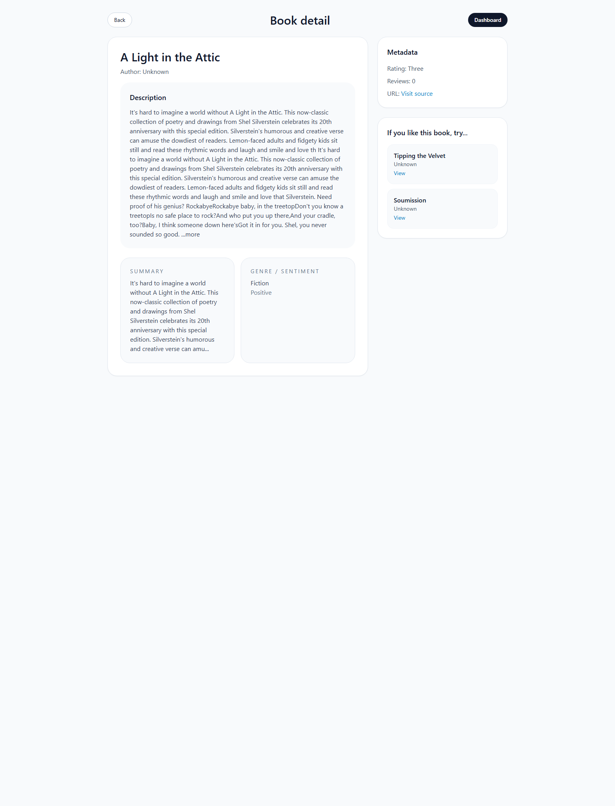

# EgroSphere - AI Document Intelligence Platform

EgroSphere is a full-stack book intelligence application built for the Document Intelligence Platform assessment. It combines Selenium-based web automation, Django REST APIs, MySQL-compatible metadata storage, Chroma vector search, and a Next.js + Tailwind frontend for browsing books and asking grounded questions over indexed book text.

## UI Screenshots

### Dashboard and import workflow


### Book listing and metadata cards


### Q&A workspace with summary, genre, and recommendations


### Book detail page


## Assessment Coverage

- Collects book data with Selenium-first automation and multi-page scraping.
- Stores metadata in Django models with MySQL support and SQLite fallback.
- Generates AI insights: summary, genre classification, and sentiment analysis.
- Supports semantic recommendations and recommendation endpoints.
- Implements a RAG pipeline with chunking, embeddings, similarity search, grounded context, and source citations.
- Exposes the workflow through REST APIs.
- Provides a responsive Next.js frontend for listing, details, upload/import, and Q&A.

## Tech Stack

| Layer | Technology |
| --- | --- |
| Backend | Django, Django REST Framework |
| Metadata DB | MySQL (assessment path), SQLite fallback |
| Vector DB | ChromaDB |
| Embeddings | SentenceTransformers (`all-MiniLM-L6-v2`) |
| AI Providers | OpenAI API or LM Studio |
| Automation | Selenium |
| Frontend | Next.js, React, Tailwind CSS |

## Key Features

- Selenium-driven scraping for `books.toscrape.com` with multi-page support.
- Generic same-domain crawl path for non-demo book pages.
- File upload ingestion for `.txt`, `.md`, `.html`, and `.htm` book content.
- Smart chunking with sentence-aware overlap.
- In-memory caching for embeddings and LLM responses.
- Book-scoped RAG: when a user selects a book, retrieval is filtered to that book only.
- Semantic recommendation flow based on vector similarity between books.
- Frontend pages for dashboard, book details, and question-answering.

## Project Structure

```text
egrosphere/
|-- backend/
|   |-- backend/
|   |   |-- settings.py
|   |   `-- urls.py
|   |-- books/
|   |   |-- models.py
|   |   |-- serializers.py
|   |   |-- urls.py
|   |   `-- views.py
|   `-- document_engine/
|       |-- ai.py
|       |-- rag.py
|       |-- scraper.py
|       `-- utils.py
|-- frontend/
|   |-- components/
|   |   `-- BookCard.js
|   |-- pages/
|   |   |-- index.js
|   |   |-- qa.js
|   |   `-- book/[id].js
|   `-- styles/
|       `-- globals.css
|-- samples/
|   |-- books/library-mystery.txt
|   `-- sample-questions.md
|-- API_DOCUMENTATION.md
|-- requirements.txt
`-- README.md
```

## Setup Instructions

### 1. Clone and install backend dependencies

```bash
python -m venv .venv
.venv\Scripts\activate
pip install -r requirements.txt
```

### 2. Configure environment

Create `.env` from `.env.example`.

For assessment parity, use MySQL:

```env
DEBUG=1
DJANGO_SECRET_KEY=replace-with-a-secure-secret
DB_ENGINE=mysql
DB_NAME=egrosphere
DB_USER=root
DB_PASSWORD=your_password
DB_HOST=127.0.0.1
DB_PORT=3306
OPENAI_API_KEY=
LLM_BASE_URL=http://127.0.0.1:1234/v1
LLM_MODEL=local-model-name
AI_CACHE_TIMEOUT=86400
```

If you only want a quick local run, you can switch `DB_ENGINE=sqlite`.

### 3. Run migrations

```bash
cd backend
python manage.py migrate
```

### 4. Start the backend

```bash
python manage.py runserver 0.0.0.0:8000
```

The backend will be available at `http://localhost:8000/api/`.

### 5. Start the frontend

```bash
cd frontend
npm install
npm run dev
```

The frontend will be available at `http://localhost:3000`.

## AI Configuration

### Option 1: OpenAI

- Set `OPENAI_API_KEY`.
- Leave `LLM_BASE_URL` empty.
- Set `LLM_MODEL` to an OpenAI chat model such as `gpt-4o-mini`.

### Option 2: LM Studio

- Run LM Studio locally and start its OpenAI-compatible server.
- Set `LLM_BASE_URL=http://127.0.0.1:1234/v1`.
- Set `LLM_MODEL` to the loaded local model name.
- `OPENAI_API_KEY` can stay empty.

## API Summary

### GET

- `GET /api/books/` - list all books
- `GET /api/books/<id>/` - get book details and indexed chunks
- `GET /api/books/<id>/recommendations/` - semantic related-book recommendations

### POST

- `POST /api/books/upload/` - scrape books from the web
- `POST /api/books/upload-file/` - upload and index local book text
- `POST /api/qa/` - ask a grounded question over all books or one selected book

See [API_DOCUMENTATION.md](API_DOCUMENTATION.md) for request/response examples.

## Sample Questions and Answers

### Sample question 1

Question:

```text
What tone does this book have?
```

Answer captured from the current system for `A Light in the Attic`:

```text
Based on the retrieved passages, [1] A Light in the Attic It's hard to imagine a world without A Light in the Attic. This now-classic collection of poetry and drawings from Shel Silverstein celebrates its 20th anniversary with this...
```

### Sample question 2

Question:

```text
What is the central conflict in this book?
```

Suggested prompt to use after uploading `samples/books/library-mystery.txt`:

```text
What is the central conflict in this book?
```

Expected answer theme:

```text
The conflict centers on whether Mira should protect a hidden archive that preserves politically sensitive testimony, even if doing so risks her job, her mentor, and public access to the collection.
```

More prompts are provided in [samples/sample-questions.md](samples/sample-questions.md).

## Testing the Application

### Scrape books from the web

```bash
curl -X POST http://localhost:8000/api/books/upload/ ^
  -H "Content-Type: application/json" ^
  -d "{\"source_url\":\"https://books.toscrape.com/catalogue/page-1.html\",\"limit\":5}"
```

### Upload a local sample file

```bash
curl -X POST http://localhost:8000/api/books/upload-file/ ^
  -F "file=@samples/books/library-mystery.txt" ^
  -F "author=Sample Author"
```

### Ask a book-specific question

```bash
curl -X POST http://localhost:8000/api/qa/ ^
  -H "Content-Type: application/json" ^
  -d "{\"question\":\"What is the theme of this book?\",\"book_id\":1}"
```

## Submission Notes

- `requirements.txt` includes all backend dependencies.
- The frontend uses Next.js with Tailwind CSS as requested.
- The repository includes sample upload content and prompt ideas.
- The app supports MySQL for assessment submission and SQLite for lighter local testing.

## Verification

Verified locally with:

- `python manage.py check`
- `npm run build`
- `POST /api/qa/` with `book_id=1`, confirmed to return only sources from book `1`
- Selenium driver creation and scraping import test on `books.toscrape.com`
